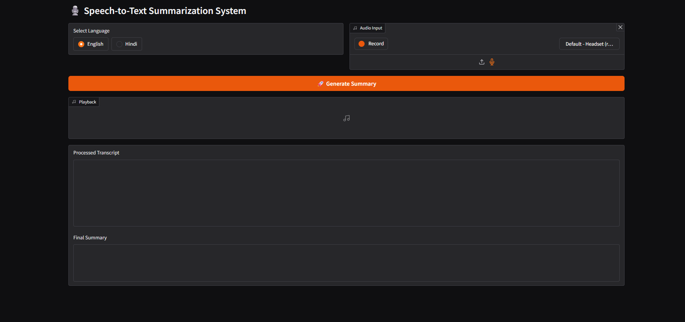
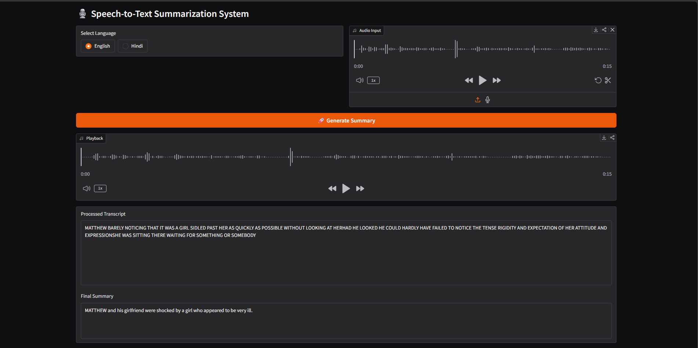
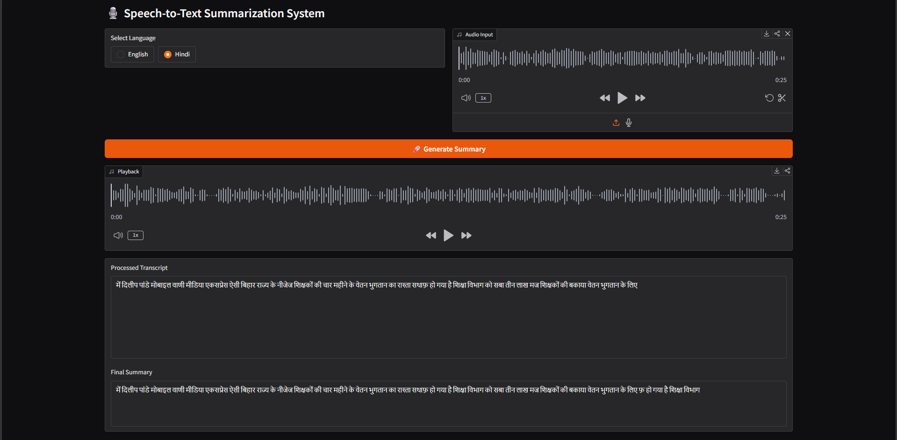
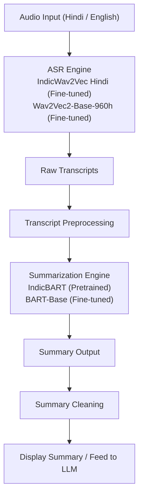

# 🎙️ Multilingual Speech-to-Text Summarization System

A multilingual end-to-end Speech Recognition and Summarization system for **Hindi** and **English** speech using:

* Fine-tuned **Wav2Vec2** ASR models
* **IndicBART** for Hindi summarization
* Fine-tuned **BART** for English summarization
* Dynamic Gradio-based inference pipeline

This project was developed as a Final Year Project focused on multilingual ASR research, summarization, optimization, and deployment under limited hardware constraints.

---

# 🚀 Features

* 🎤 Audio Upload + Microphone Recording
* 🌐 Hindi and English Language Support
* 🧠 Fine-tuned Wav2Vec2 ASR Models
* 📝 Automatic Speech Summarization
* ⚡ Dynamic Model Loading & VRAM Cleanup
* 📉 Evaluation using WER, CER, ROUGE, and BERTScore
* 🖥️ Gradio-based Interactive Interface
* 🔄 Real-time End-to-End Pipeline

---

# 🖥️ Demo Screenshots

## Main Interface



---

## English Transcription & Summary



---

## Hindi Transcription & Summary



---

# ⚡ Quick Demo

```bash
pip install -r requirements.txt
python app.py
```

---

# 📌 Example Output

## Transcript

```text
The government announced new education policies today...
```

## Summary

```text
The speech discussed newly announced education reforms...
```

---

# 🏗️ Final Architecture



---

# 📌 Project Motivation

Traditional multilingual ASR systems struggle with:

* Noisy speech
* Code-mixed language
* Low-resource Indian languages
* High inference latency
* Limited hardware availability

This project explores practical solutions using:

* Fine-tuning
* Language-aware pipelines
* Model optimization
* Lightweight deployment strategies

---

# 🧠 Models Used

## ASR Models

| Language | Model                  |
| -------- | ---------------------- |
| Hindi    | AI4Bharat IndicWav2Vec |
| English  | Wav2Vec2-Base-960h     |

---

## Summarization Models

| Language | Model           |
| -------- | --------------- |
| Hindi    | IndicBART       |
| English  | Fine-tuned BART |

---

# 📊 Evaluation Metrics

## ASR Evaluation

* WER (Word Error Rate)
* CER (Character Error Rate)

---

## Summarization Evaluation

* ROUGE
* BERTScore

---

# 📊 Experimental Results

## 🎤 ASR Evaluation Results

### Baseline Whisper Results

| Language | WER ↓ | CER ↓ | Observation                      |
| -------- | ----- | ----- | -------------------------------- |
| English  | 0.064 | 0.029 | Very high transcription accuracy |
| Hindi    | 1.569 | 1.430 | Severe multilingual/script drift |

### Whisper Hindi Observation

Although Whisper captured phonetic content reasonably well, it frequently generated:

* Urdu script outputs
* Romanized Hindi
* Script inconsistencies

This caused extremely poor WER/CER despite partial phonetic correctness.

Example:

```text id="j4t7dq"
REF : और ऐसे ही बड़ी खबरों के लिए सुनते रहे मधुवनी मोबाइल वाणी धन्यवाद
PRED: اور ایسے ہی بڑی خبروکیل سنتے رہے مدوانی موائلوانی دن نواض
```

---

## 🎯 Final Wav2Vec2 Results

| Language | Model                  | WER ↓ | CER ↓ |
| -------- | ---------------------- | ----- | ----- |
| Hindi    | AI4Bharat IndicWav2Vec | 0.398 | 0.175 |
| English  | Wav2Vec2-Base-960h     | 0.064 | 0.029 |

### Key Observations

#### Hindi ASR

* Significant improvement over Whisper baseline
* Better phonetic preservation
* Better script consistency
* Lower multilingual drift
* Still benefits from language-model-based correction

#### English ASR

* Near-production-quality performance
* Strong generalization without extensive fine-tuning
* Highly stable transcription quality

---

# 📝 Summarization Evaluation Results

## English Summarization

### Best Performing Model

* Fine-tuned BART

### Evaluation Metrics

| Metric    | Score |
| --------- | ----- |
| ROUGE     | ~0.40 |
| BERTScore | ~0.89 |

### Observations

* Strong semantic understanding
* Good information coverage
* Balanced precision and recall
* Low hallucination tendency

However:

* Contextual conversational understanding remained limited
* Long-range dialogue dependencies were still challenging

---

## Hindi Summarization

### Best Performing Model

* IndicBART (Pretrained)

### Observations

Hindi summarization proved significantly more difficult due to:

* Noisy ASR transcripts
* Morphologically rich language structure
* Multilingual generation complexity
* Limited high-quality summarization datasets

### Models Tested

| Model           | Result                                         |
| --------------- | ---------------------------------------------- |
| IndicBART       | Best overall                                   |
| FLAN-T5         | Unstable                                       |
| mT5             | Failed                                         |
| PEGASUS         | Poor multilingual handling                     |
| Gemma 2B + BART | Good metrics but weak contextual understanding |

---

# 🧪 Overall Experimental Conclusions

## ASR

* Whisper performs extremely well for English
* Whisper struggles heavily with Hindi script consistency
* Language-aware Wav2Vec2 models significantly improve multilingual ASR performance
* AI4Bharat IndicWav2Vec achieved the best Hindi transcription quality

---

## Summarization

* Traditional summarizers struggle with noisy ASR outputs
* IndicBART proved highly effective for Hindi summarization
* Fine-tuned BART gave the best English summaries
* Context-aware conversational summarization remains an open research challenge

---

# 📈 Final System Performance

The final multilingual pipeline successfully achieved:

* Real-time inference capability
* Efficient GPU utilization
* Stable multilingual ASR
* Practical speech summarization
* Memory-optimized deployment on RTX 3060 (6GB VRAM)

This demonstrates that lightweight multilingual speech summarization systems can be effectively developed even under limited hardware constraints.

---

# 🔬 Research & Experimentation

## Whisper Baseline

Initially, OpenAI Whisper was used as the baseline ASR model.

### Problems Observed

* High inference latency
* Low GPU utilization
* CPU-heavy preprocessing
* Sequential inference bottlenecks

---

## Faster-Whisper Optimization

The pipeline was migrated to Faster-Whisper using CTranslate2.

### Improvements

| Metric     | Whisper       | Faster-Whisper      |
| ---------- | ------------- | ------------------- |
| Speed      | ~6 sec/sample | ~0.3–0.7 sec/sample |
| GPU Usage  | Low           | High                |
| VRAM Usage | ~1.3 GB       | ~3–5 GB             |

This significantly improved inference efficiency and scalability.

---

# 🔬 Wav2Vec2 Experiments

Several approaches were explored:

## 1. Pretrained Fine-tuning

Initially trained using:

* facebook/wav2vec2-large-xlsr-53
* Custom tokenizer
* Character-level vocabulary

### Problems

* Extremely slow training
* Large model size
* Poor multilingual handling
* Weak CTC decoding for code-mixed speech

---

## 2. Training Strategy Improvements

Implemented:

* Curriculum-style learning
* Short-to-long audio training
* Penalty systems for repetitive outputs
* Dataset balancing

---

## 3. Final Hindi Solution

Switched to:

* AI4Bharat IndicWav2Vec

This achieved significantly better Hindi ASR performance compared to Whisper.

---

# 📝 Summarization Experiments

Tested multiple models:

| Model     | Result                        |
| --------- | ----------------------------- |
| BART      | Best English Results          |
| IndicBART | Best Hindi Results            |
| mT5       | Failed / unstable             |
| PEGASUS   | Poor multilingual performance |
| FlanT5    | Inconsistent                  |
| Gemma 2B  | Experimental                  |

---

# 🧹 Transcript Processing

Implemented preprocessing pipeline:

* Noise removal
* Text cleaning
* Punctuation normalization
* Character filtering
* Sentence formatting

---

# 📁 Project Structure

```text
analysis/
│
├── compare_results_ASR.ipynb
├── compare_results_SUM.ipynb

data/
│
├── clean/
│   ├── Hindi_text_sum/
│   └── samsum/
│
└── processed/asr/
    ├── english/
    └── hindi/

evaluation/
│
├── asr/
└── summarization/

experiments/
│
├── asr/
└── summarization/

models/
│
├── asr/
│   ├── english/final/
│   └── hindi/final/
│
└── summarization/

notebooks/

scripts/
│
├── asr/
├── summarization/
└── app/

app.py
plan.md
README.md
requirements.txt
```

---

# 🖥️ Demo Application

The project includes a Gradio-based interface with:

* Microphone recording
* Audio upload
* Real-time transcription
* Automatic summarization

---

# ⚡ Memory Optimization

Implemented dynamic loading system:

* No model preloading
* VRAM cleanup on language switch
* Lazy audio processing
* Disk-based audio handling
* CPU-based summarization pipeline

This allows execution on:

* RTX 3060 6GB
* Limited-memory systems

---

# ⚡ Dynamic Loading System

To support low-VRAM GPUs:

- Models are loaded only after inference request
- Previous models are removed from VRAM on language switch
- Audio is processed from disk instead of memory
- Summarization runs on CPU to reduce GPU load

---

# 💻 Hardware Used

- GPU: RTX 3060 6GB
- RAM: 16GB
- CUDA Version: 12.x
- Framework: PyTorch

---

# 🛠️ Installation

## Clone Repository

```bash
git clone <your_repo_url>
cd <repo_name>
```

---

## Install Dependencies

```bash
pip install -r requirements.txt
```

---

## Run Application

```bash
python app.py
```

---

# 📈 Future Improvements

* Code-mixed ASR improvements
* Grammar correction layer
* LLM-based semantic correction
* Mobile application
* Quantized lightweight deployment
* Additional Indian language support
* Speaker-aware transcription
* Real-time streaming inference

---

# 📚 Technologies Used

* Python
* PyTorch
* Transformers
* Torchaudio
* Gradio
* HuggingFace
* IndicNLP
* NumPy

---

# 📂 Datasets Used

## ASR
- Hindi speech dataset: Gram Vaani 100H
- English speech dataset

## Summarization
- SAMSum
- Hindi News Summarization Dataset

---

# 👨‍💻 Author

Final Year Research Project
Multilingual Speech Recognition & Summarization System

Author: Shubham Pandey

Linkedin: [Click Here](https://www.linkedin.com/in/shubham-pandey-6a65a524a/)
Email: [Click Here](mailto:shubhamppandey1084@gmail.com)

---

# 📜 License

This project is intended for research and educational purposes.
